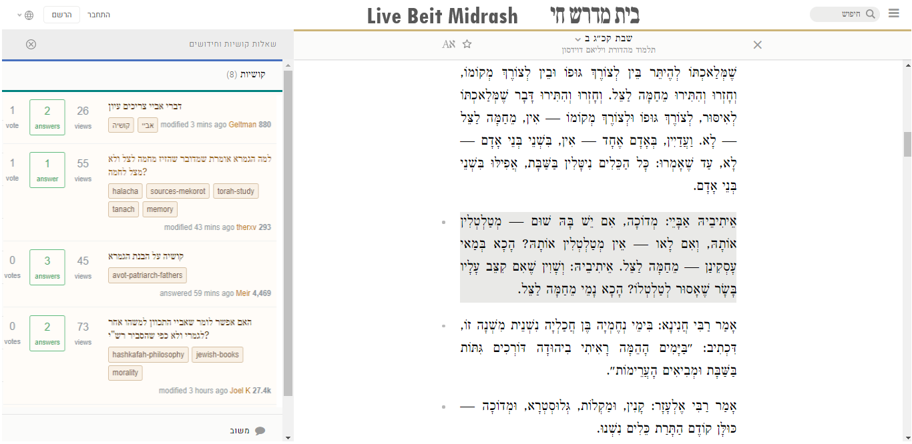

# sefaria-interactive-simple

Sefaria clone with Stack Overflow-like features

## To begin collaborating

### Follow these steps:

#### Setup the coding environment

 - Install nodeJS (LTS version) - https://nodejs.org/dist/v12.18.3/node-v12.18.3-x64.msi

 - Install Git (do not change default options during installation) - https://git-scm.com/download/win

 - Install GitHub Desktop - Windows: https://central.github.com/deployments/desktop/desktop/latest/win32 Linux: https://github.com/shiftkey/desktop/releases

 - Create GitHub account - https://github.com/

 - Install Visual Studio Code - https://code.visualstudio.com/

 - Request access to the code repository - https://github.com/akivamprager/sefaria-interactive-simple
 - Open the repository with GitHub Desktop (on the website click the green dropdown button)

 - Open VS Code, and select File > Add Folder to Workspace...

 - Select the repository

 - open the terminal (ctrl+shift+`) and type <code>node .\index.js</code>

 - point your web browser at http://localhost/3000

 - You can now begin working! whenever you want to commit the code you've worked on, use the GitHub Desktop application to commit, and then Push to update changes online. Click Fetch to update the changes from others.

 - for testing things, the discourse site is hosted at http://discourse2.akiva.ml
 - documentation for discourse at https://docs.discourse.org/ , and you can also take any link on discourse and add .json to get json object (example - check [http://discourse2.akiva.ml/c/questions/5](http://discourse2.akiva.ml/c/questions/5) vs [http://discourse2.akiva.ml/c/questions/5.json](http://discourse2.akiva.ml/c/questions/5.json) 
 - you can also always use http://localhost:3000/api/v1/{WHATEVER} to test json requests directly.
## Project Directory Explanation
The project source code has two main directories:

 - api/v1 - this is not meant for the user's browser to read - it hosts all of the API methods to connect to sefaria and discourse. The client side "public" folder calls the API whenever it needs to connect to anything.
 - public - this is what the client side sees, at index.html
	 - the "js" folder has all the javascript methods that access the API

The structure for the index.html page is as following:

    http://localhost:3000/?location=BOOK.CHAPTER
   examples: `http://localhost:3000/?location=Bereshit.23`
   `http://localhost:3000/?location=Sanhedrin.67b`
 and the Discourse threads for this page will include a tag that looks like this:
 
    BOOK-CHAPTER-LINE
examples: `Bereshit-23-8` `Sanhedrin-67b-5` ("line" refers to the line or Pasuk in the page) 
## Helpful Resources
 - Node JS tutorial - [https://www.w3schools.com/nodejs/](https://www.w3schools.com/nodejs/) 
 - React JS tutorial - [https://reactjs.org/tutorial/tutorial.html](https://reactjs.org/tutorial/tutorial.html)
 - Sefaria API - [https://github.com/Sefaria/Sefaria-Project/wiki/API-Documentation](https://github.com/Sefaria/Sefaria-Project/wiki/API-Documentation)
 - Discourse API - [https://docs.discourse.org/](https://docs.discourse.org/)
 - Axios tutorial - [http://zetcode.com/javascript/axios/](http://zetcode.com/javascript/axios/)
 - Express Routing - [https://expressjs.com/en/starter/basic-routing.html](https://expressjs.com/en/starter/basic-routing.html)
 - ...ואידך זיל גמור

## Workflow 

#### The work will be split into a few parts:

 -  **The front-end application** - creating a website with a Sefaria-like UI/UX, plus a sidepane which will display all comments/questions and such. The data from Sefaria and from our comments database will eventually be served up by our API, but for now the UI can be developed with dummy values for simulation.
It should have a few components:
	 - Section showing the selected text (for example - http://localhost:3000/?location=Bereshit.5) split into lines (like in Sefaria)
	 When a user clicks on a line, the Discourse section will automatically show all of the threads for that specific line, and add a button for adding a new thread 
	 - Discourse Section showing all of the threads of questions/kashyas/references etc. split into three tabs:
		 - Questions - a list of question titles, along with data about the question (when created, how popular, how many answers... and so on)
		 When a user clicks on a question title, it will expand to show all posts in that question thread, and show buttons for replying.
		 - Chiddushim - same
		 - Kashyas (קושיות) - same
		 - References and notes (מראי מקומות והערות)  - same
	 - Sign in via Google button and indicator

 -  **The Sefaria API** - working on "plugging in" the text from Sefaria into our web UI.
	 - API for getting the texts basically exists already in our project.

 -  **The Discourse API** - working on "plugging in" the threads from Discourse into our web UI.
	 - creating methods for CRUD (read, create, update, delete) - for reading topics/posts, adding new ones, and such.
	 - adding authentication - right now every new topic or comment created with our API is created by Discourse user "System", but eventually we would want users to authenticate via Google to have their own user account. 

## Next Steps

 - [ ] Navigation home page - like sefaria's, so users will be to navigate to specific texts.

 Basically gradually porting all Discourse's UI features to our site - including:
 - [ ] Adding voting features - so users can decide if a question is a good one or if a specific answer is right...
 - [ ] Accept as solution - allow the original person who had the question to accept a specific answer as correct.
 - [ ] and many more - list to be continued...

## Need Help/Explanation?
Just call or whatsapp me... 
## What it should (sort of) look like at the end

